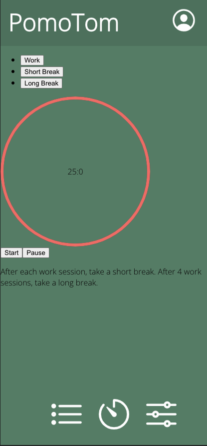
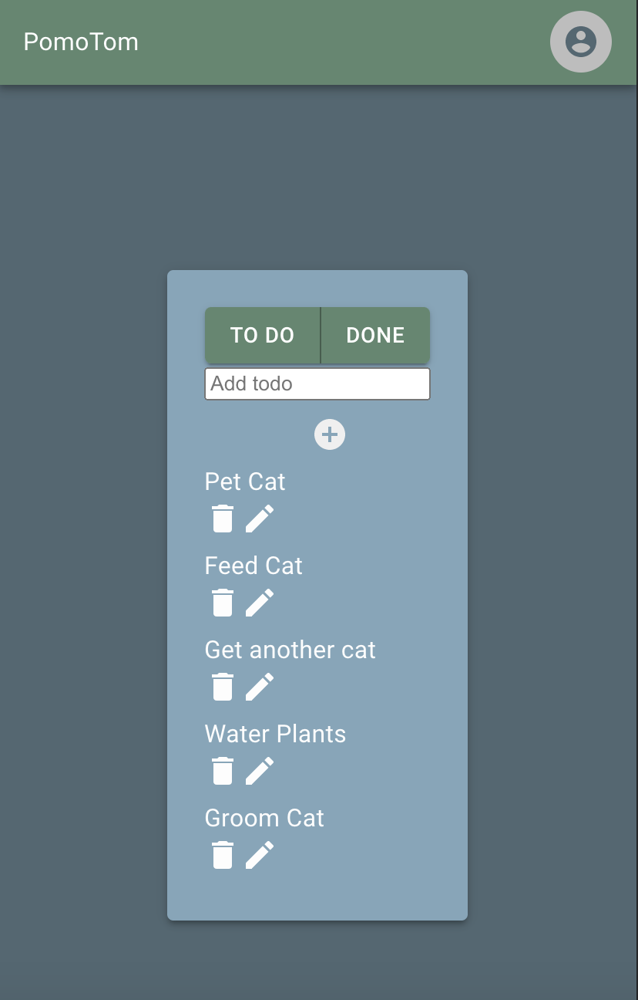

## PomoTom

#### PomoTom is a time based productivity application developed with full CRUD capabilities using the MERN stack.  It is designed to help the user manage tasks by breaking work blocks into smaller sessions broken up by short breaks.  The theory is based on the 80:20 model of the Pomodoro Technique.  

## Description
The Pomodoro Technique is a time management system that encourages people to accomplish more in less time by preventing decision fatigue and increasing concentration. Our goal is to customize the classic Pomodoro techniqe by making it more useful by adding user authentication, customized to-do list, tips and tricks, and more. 

## Table of Contents
* [Technologies Used](#technologiesused)
* [Features](#features)
* [Design](#design)
* [Project Next Steps](#nextsteps)
* [Deployed App](#deployment)
* [About the Developers](#developers)

## Technologies Used
* JavaScript
* HTML5
* CSS3
* Node.Js
* MongoDB
* React.js
* Express.js
* RESTful Routes
* Material UI
* React Icons
* Ionicon
* Figma

## Features
* Users can run full C.R.U.D. operation within a to-do list. 
* Timer functionality in increments of 25, 15, and 5 minute work sessions.

## Link to Pitch Deck
* Link to Pitch Deck: [Pitch Presentation](https://docs.google.com/presentation/d/1LLj6WNbY9kITghVSYNXZCIMY5GuXAjZPAOAKKIVsH4g/edit?usp=sharing)

## Design
* Design elements implemented using React.js, Material UI and CSS3.

* Link to Mockup Wireframe:
[Wireframe](https://www.figma.com/file/0iEJbs221Ei5F5tpIVyCj6/WireFrame)

* Link to High Fidelity Wireframe:
[High Fedelity Mockup](https://www.figma.com/file/yGUPLZBO8JIZlVR0rFPJ5O/Pomodoro-Mockup-(high-fidelity))

## Trello Planning
* Link to Trello: [Trello Board](https://trello.com/b/SOrCGNfo/pomodoro-group-project)

## Project Next Steps
* User Authentication
* Automatic flow between focus, short break and long break sessions.  
* Link to-do list to each work block.
* Add success quotes at the end of each completed work block.

## Deployed Link
* Deployment: [The PomoTom App](https://pomotom.com/)

* You can view the repositories at:
Frontend: [Github.com/Frontend](https://github.com/krismally/pomo-frontend)
Backend: [Github.com/Backend](https://github.com/krismally/pomo-backend)
If unable to view please go live locally through VS Code
    
## The Dream Team
Classmates turned friends brought together through GA's Software Engineering Immersive have developed their first web application together -- PomoTom. 
* Jessie Zollinger: Front End Lead/ Design  
* Chyanne Robbins: Backend Lead / Branch Manager
* Kris Mally: Product Manager / Planning Fiend 

    

