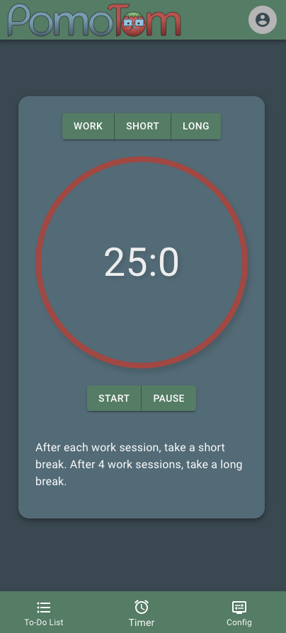

## PomoTom

#### A Full-Stack CRUD application designed to help users effectively manage time by breaking work sessions into 25 minute chunks, separated by five-minute breaks. After four pomodoros, a longer 15 minutee break is taken.  

## Description
The Pomodoro Technique is a time managment system that encourages people to accomplish more in less time by preventing decision fatigue and increasing concentration. Our goal is to customize the classic Pomodoro techniqe by making it more useful by adding user authentication, customized to-do list, tips and tricks, and more. 

## Table of Contents
* [Technologies Used](#technologiesused)
* [Features](#features)
* [Design](#design)
* [Project Next Steps](#nextsteps)
* [Deployed App](#deployment)
* [About the Developers](#author)

## Technologies Used
* JavaScript
* HTML5
* CSS3
* Material UI
* Node.Js
* MongoDB
* React.js
* Express.js
* RESTful Routes
* MERN

## Features
* Users can run full C.R.U.D. operation within a to-do list. 
* Timer functionality in increments of 25, 15, and 5 minute work sessions.

## Whiteboard Mockup
* Link to Figma:
[Figma.com](https://www.figma.com/file/yGUPLZBO8JIZlVR0rFPJ5O/Pomodoro-Mockup-(high-fidelity)?node-id=0%3A1)

## Trello Planning
* Link to Trello: [Trello.com](https://trello.com/b/SOrCGNfo/pomodoro-group-project)

## Link to Pitch Deck
* Link to Pitch Deck: [Google.com](https://docs.google.com/presentation/d/1LLj6WNbY9kITghVSYNXZCIMY5GuXAjZPAOAKKIVsH4g/edit?usp=sharing)

## Design
* Design elements implemented using React.js, Material UI and CSS3.

## Project Next Steps
* User Authentication
* Automatic flow between focus, short break and long break sessions.  
* Link to-do list to each work block.
* Add success quotes at the end of each completed work block.

## Deployed Link
* Deployment: [Pomotom.com](https://pomotom.com/)

* You can view the repositories at:
Frontend: [Github.com](https://github.com/krismally/pomo-frontend)
Backend: [Github.com](https://github.com/krismally/pomo-backend)
* If unable to view please go live locally through VS Code
    
## The Dream Team
### Jessie Zollinger, Chyanne Robbins and Kris Mally
Classmates turned friends brought together through GA's Software Engineering Immersive have developed their first web application together -- PomoTom. 
Jessie: Front End Lead/ Design  
Chyanne: Backend Lead / Branch Manager
Kris: Product Manager / Planning Fiend 

    

